[TOC]

# 作业4

* ###### 说明
    hadoop streaming 框架 用 stdin 和 stdout 的方式支持多种语言 这种方式方便本地调试

    shell python 这类脚本语言 代码简洁 开发效率高，在大多应用场景下 利用hadoop streaming框架 基本可以胜任

## 1. WordCount2

忽略大小写，忽略各种标点符号，‘-’除外

* ##### 编译打包
> $ hadoop com.sun.tools.javac.Main WordCount2.java
> 
> $ jar cf wc.jar WordCount*.class

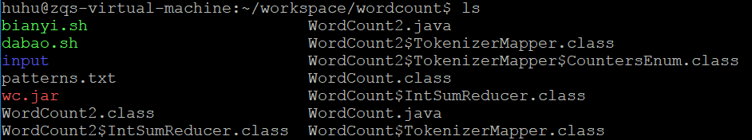

* ##### Input
> $ hdfs dfs -ls wordcount/input


* 
> $ hdfs dfs -cat wordcount/input/file01
> 
> $ hdfs dfs -cat wordcount/input/file02
> 
> $ hdfs dfs -cat wordcount/input/file03


* ##### Skip patterns
> $ hdfs dfs -cat wordcount/patterns.txt

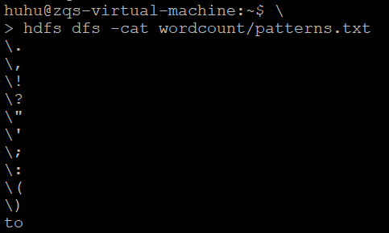

* ##### Run the application
> $ hadoop jar wc.jar WordCount2 wordcount/input wordcount/output –skip wordcount/patterns.txt

* ##### Output
> $ hdfs dfs –cat wordcount/output/*


* ##### Java code
(参考官方源码 + debug + 修改 )

```java
/* WordCount2.java */
import java.io.BufferedReader;
import java.io.FileReader;
import java.io.IOException;
import java.net.URI;
import java.util.ArrayList;
import java.util.HashSet;
import java.util.List;
import java.util.Set;
import java.util.StringTokenizer;

import org.apache.hadoop.conf.Configuration;
import org.apache.hadoop.fs.Path;
import org.apache.hadoop.io.IntWritable;
import org.apache.hadoop.io.Text;
import org.apache.hadoop.mapreduce.Job;
import org.apache.hadoop.mapreduce.Mapper;
import org.apache.hadoop.mapreduce.Reducer;
import org.apache.hadoop.mapreduce.lib.input.FileInputFormat;
import org.apache.hadoop.mapreduce.lib.output.FileOutputFormat;
import org.apache.hadoop.mapreduce.Counter;
import org.apache.hadoop.util.GenericOptionsParser;
import org.apache.hadoop.util.StringUtils;

public class WordCount2 {

  public static class TokenizerMapper
       extends Mapper<Object, Text, Text, IntWritable>{

    static enum CountersEnum { INPUT_WORDS }

    private final static IntWritable one = new IntWritable(1);
    private Text word = new Text();

    private boolean caseSensitive;
    private Set<String> patternsToSkip = new HashSet<String>();

    private Configuration conf;
    private BufferedReader fis;

    @Override
    public void setup(Context context) throws IOException,
        InterruptedException {
      conf = context.getConfiguration();
      caseSensitive = conf.getBoolean("wordcount.case.sensitive", false);
      if (conf.getBoolean("wordcount.skip.patterns", false)) {
        URI[] patternsURIs = Job.getInstance(conf).getCacheFiles();
        for (URI patternsURI : patternsURIs) {
          Path patternsPath = new Path(patternsURI.getPath());
          String patternsFileName = patternsPath.getName().toString();
          parseSkipFile(patternsFileName);
        }
      }
    }

    private void parseSkipFile(String fileName) {
      try {
        fis = new BufferedReader(new FileReader(fileName));
        String pattern = null;
        while ((pattern = fis.readLine()) != null) {
          patternsToSkip.add(pattern);
        }
      } catch (IOException ioe) {
        System.err.println("Caught exception while parsing the cached file '"
            + StringUtils.stringifyException(ioe));
      }
    }

    @Override
    public void map(Object key, Text value, Context context
                    ) throws IOException, InterruptedException {
      String line = (caseSensitive) ?
          value.toString() : value.toString().toLowerCase();
      for (String pattern : patternsToSkip) {
        line = line.replaceAll(pattern, "");
      }
      StringTokenizer itr = new StringTokenizer(line);
      while (itr.hasMoreTokens()) {
        word.set(itr.nextToken());
        context.write(word, one);
        Counter counter = context.getCounter(CountersEnum.class.getName(),
            CountersEnum.INPUT_WORDS.toString());
        counter.increment(1);
      }
    }
  }

  public static class IntSumReducer
       extends Reducer<Text,IntWritable,Text,IntWritable> {
    private IntWritable result = new IntWritable();

    public void reduce(Text key, Iterable<IntWritable> values,
                       Context context
                       ) throws IOException, InterruptedException {
      int sum = 0;
      for (IntWritable val : values) {
        sum += val.get();
      }
      result.set(sum);
      context.write(key, result);
    }
  }

  public static void main(String[] args) throws Exception {
    Configuration conf = new Configuration();
    GenericOptionsParser optionParser = new GenericOptionsParser(conf, args);
    String[] remainingArgs = optionParser.getRemainingArgs();
    if (!(remainingArgs.length == 2 || remainingArgs.length == 4)) {
      System.err.println("Usage: wordcount <in> <out> [-skip skipPatternFile]");
      System.exit(2);
    }
    Job job = Job.getInstance(conf, "word count");
    job.setJarByClass(WordCount2.class);
    job.setMapperClass(TokenizerMapper.class);
    job.setCombinerClass(IntSumReducer.class);
    job.setReducerClass(IntSumReducer.class);
    job.setOutputKeyClass(Text.class);
    job.setOutputValueClass(IntWritable.class);

    List<String> otherArgs = new ArrayList<String>();
    for (int i=0; i < remainingArgs.length; ++i) {
      if ("-skip".equals(remainingArgs[i])) {
        job.addCacheFile(new Path(remainingArgs[++i]).toUri());
        job.getConfiguration().setBoolean("wordcount.skip.patterns", true);
      } else {
        otherArgs.add(remainingArgs[i]);
      }
    }
    FileInputFormat.addInputPath(job, new Path(otherArgs.get(0)));
    FileOutputFormat.setOutputPath(job, new Path(otherArgs.get(1)));

    System.exit(job.waitForCompletion(true) ? 0 : 1);
  }
}

```

##2. 矩阵乘法

* ### Python

* ##### 目录结构

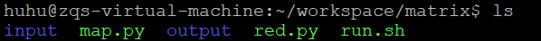

* ##### Input

**说明：** 作了一些修改： 删去部分行： 这些行的值是 0 ：这样的测试例子更强一些

    考虑到矩阵应用的实际场景中， 必然是大型矩阵（不然也不是大数据）， 
    同时大多时候都是稀疏矩阵， 即矩阵中有很多 0， 这些值为 0 的行列没有必要记录下来， 
    否则太浪费空间， 故没有出现的 行列(格子) 其值为 0

（这是对 **矩阵** 表示的 **数据结构** 的定义，所以 **输出的矩阵** 也按这个 **数据结构** 要求） 

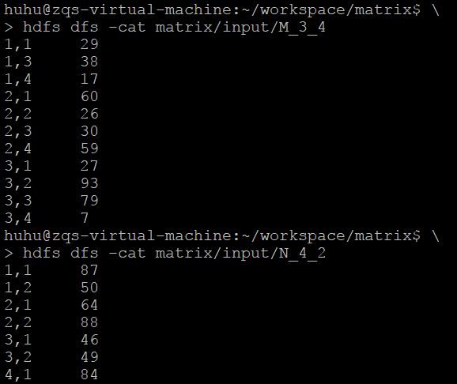

* ##### Run the application
> ./run.sh < row > < column >
> 
> ./run.sh 3 2

* ##### 运行说明


        这里 要求输入 M矩阵的行数(3) 和 N矩阵的列数(2) 
        因为考虑到 Java 的程序 要求输入 M_3_4 N_4_2 也包含了这些信息
        与Java程序相同，先将个两个矩阵文件放入hdfs的input文件夹中
        所以要说明的是 这个 python程序的 使用和泛化性 不会弱于 Java程序

* ##### Output

（已经过检查校对）

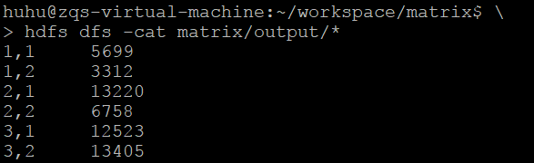

* ##### 程序算法说明

    这里使用了 hadoop streaming + python 解决问题

* **算法上也作了一些修改/改进**

** intermediate key/value pairs ** (部分)

    1.1.1.29
    1.1.1.87
    1.1.2.64
    1.1.3.38
    1.1.3.46
    1.1.4.17
    1.1.4.84
    1.2.1.29
    1.2.1.50
    1.2.2.88
    1.2.3.38
    1.2.3.49
    1.2.4.17

    一共四列： 记为： < i, j, k, v >
        < i, j >： 即表示 输出矩阵 的 第i行 第j列
        < k >： 对于 M矩阵: <i, k> 第i行 第k列 
                对于 N矩阵: <k, j> 第k行 第j列
        < v >： 原矩阵的该格子的 数值

    < i, j, k > 均相同的 record 不超过 2 个
        若 有两个： 加上他们的乘积
        若 少于两个： 至少有一个是0 乘积也是0 不管了

    还有一点：
        key: < i, j, k >
        partitioner: < i, j >
        不过下面的 key 用了 ijkv 四个, 是因为之前写的时候 还不是很熟练


* ##### run.sh
```bash
set -e -x

HADOOP="/opt/hadoop-2.7.4/"
HADOOP_BIN=${HADOOP}"bin/"
STREAM_JAR_PATH=${HADOOP}"share/hadoop/tools/lib/hadoop-streaming-2.7.4.jar"

JOB_PATH="/user/huhu/matrix/"
INPUT_PATH=${JOB_PATH}"input"
OUTPUT_PATH=${JOB_PATH}"output"

${HADOOP_BIN}"hdfs" dfs -rm -r -f  -skipTrash $OUTPUT_PATH

${HADOOP_BIN}"hadoop" jar $STREAM_JAR_PATH \
    -D stream.map.output.field.separator=. \
    -D stream.num.map.output.key.fields=4 \
    -D map.output.key.field.separator=. \
    -D map.output.key.field.separator=. \
    -D mapreduce.partition.keypartitioner.options=-k1,2 \
    -partitioner org.apache.hadoop.mapred.lib.KeyFieldBasedPartitioner \
    -input $INPUT_PATH \
    -output $OUTPUT_PATH \
    -mapper "python map.py "$1" "$2 \
    -reducer "python red.py" \
    -file ./map.py \
    -file ./red.py \
```

* ##### map.py
```python3
#!/usr/bin/python3

import sys
import os

m = int(sys.argv[1])
n = int(sys.argv[2])
filename = os.getenv("mapreduce_map_input_file").split("/")[-1]
if filename[0] == 'M':
    for line in sys.stdin:
        keys, val = line.strip().split()
        row, col = keys.strip().split(',')
        for j in range(1, 1+n):
            print('.'.join([row, str(j), col, val]))
elif filename[0] == 'N':
    for line in sys.stdin:
        keys, val = line.strip().split()
        row, col = keys.strip().split(',')
        for i in range(1, 1+m):
            print('.'.join([str(i), col, row, val]))
```

* ##### red.py
```python3
#!/usr/bin/python3

import sys

c_i = c_j = cell = 0
for line in sys.stdin:
    i, j, k, v = [ int(l) for l in line.strip().split('.') ]
    if c_i != i or c_j != j :
        if cell != 0:
            print(','.join([ str(t) for t in [c_i, c_j] ] ) + '\t' + str(cell) )
        c_i, c_j, c_k, c_v, cell  = i, j, k, v, 0
        continue
    if c_k == k:
        cell += c_v * v
    else:
        c_k, c_v = k, v

if cell != 0:
    print(','.join([ str(t) for t in [c_i, c_j] ] ) + '\t' + str(cell) )
```

* ### Java

编写 MatrixMultiply.java -> IDEA中导出Jar包 -> 运行

* ##### Run the application

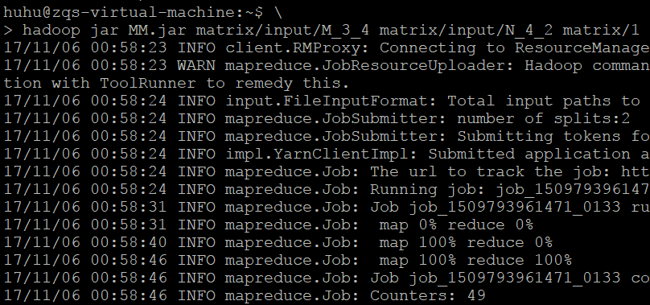

* ##### Output

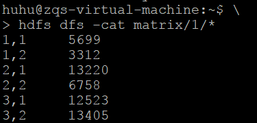

* ##### Src code

```java

import java.io.IOException;

import org.apache.hadoop.conf.Configuration;
import org.apache.hadoop.fs.Path;
import org.apache.hadoop.io.Text;
import org.apache.hadoop.mapreduce.Job;
import org.apache.hadoop.mapreduce.Mapper;
import org.apache.hadoop.mapreduce.Reducer;
import org.apache.hadoop.mapreduce.lib.input.FileInputFormat;
import org.apache.hadoop.mapreduce.lib.input.FileSplit;
import org.apache.hadoop.mapreduce.lib.output.FileOutputFormat;

public class MatrixMultiply {
  /** mapper和reducer需要的三个必要变量，由conf.get()方法得到 **/
  public static int rowM = 0;
  public static int columnM = 0;
  public static int columnN = 0;

  public static class MatrixMapper extends Mapper<Object, Text, Text, Text> {
    private Text map_key = new Text();
    private Text map_value = new Text();

    /**
     * 执行map()函数前先由conf.get()得到main函数中提供的必要变量， 这也是MapReduce中共享变量的一种方式
     */
    public void setup(Context context) throws IOException {
      Configuration conf = context.getConfiguration();
      columnN = Integer.parseInt(conf.get("columnN"));
      rowM = Integer.parseInt(conf.get("rowM"));
    }

    public void map(Object key, Text value, Context context)
        throws IOException, InterruptedException {
      /** 得到输入文件名，从而区分输入矩阵M和N **/
      FileSplit fileSplit = (FileSplit) context.getInputSplit();
      String fileName = fileSplit.getPath().getName();

      if (fileName.contains("M")) {
        String[] tuple = value.toString().split(",");
        int i = Integer.parseInt(tuple[0]);
        String[] tuples = tuple[1].split("\t");
        int j = Integer.parseInt(tuples[0]);
        int Mij = Integer.parseInt(tuples[1]);

        for (int k = 1; k < columnN + 1; k++) {
          map_key.set(i + "," + k);
          map_value.set("M" + "," + j + "," + Mij);
          context.write(map_key, map_value);
        }
      }

      else if (fileName.contains("N")) {
        String[] tuple = value.toString().split(",");
        int j = Integer.parseInt(tuple[0]);
        String[] tuples = tuple[1].split("\t");
        int k = Integer.parseInt(tuples[0]);
        int Njk = Integer.parseInt(tuples[1]);

        for (int i = 1; i < rowM + 1; i++) {
          map_key.set(i + "," + k);
          map_value.set("N" + "," + j + "," + Njk);
          context.write(map_key, map_value);
        }
      }
    }
  }

  public static class MatrixReducer extends Reducer<Text, Text, Text, Text> {
    private int sum = 0;

    public void setup(Context context) throws IOException {
      Configuration conf = context.getConfiguration();
      columnM = Integer.parseInt(conf.get("columnM"));
    }

    public void reduce(Text key, Iterable<Text> values, Context context)
        throws IOException, InterruptedException {
      int[] M = new int[columnM + 1];
      int[] N = new int[columnM + 1];

      for (Text val : values) {
        String[] tuple = val.toString().split(",");
        if (tuple[0].equals("M")) {
          M[Integer.parseInt(tuple[1])] = Integer.parseInt(tuple[2]);
        } else
          N[Integer.parseInt(tuple[1])] = Integer.parseInt(tuple[2]);
      }

      /** 根据j值，对M[j]和N[j]进行相乘累加得到乘积矩阵的数据 **/
      for (int j = 1; j < columnM + 1; j++) {
        sum += M[j] * N[j];
      }
      context.write(key, new Text(Integer.toString(sum)));
      sum = 0;
    }
  }

  /**
   * main函数
   * <p>
   * Usage:
   * 
   * <p>
   * <code>MatrixMultiply  inputPathM inputPathN outputPath</code>
   * 
   * <p>
   * 从输入文件名称中得到矩阵M的行数和列数，以及矩阵N的列数，作为重要参数传递给mapper和reducer
   * 
   * @param args 输入文件目录地址M和N以及输出目录地址
   * 
   * @throws Exception
   */

  public static void main(String[] args) throws Exception {

    if (args.length != 3) {
      System.err
          .println("Usage: MatrixMultiply <inputPathM> <inputPathN> <outputPath>");
      System.exit(2);
    } else {
      String[] infoTupleM = args[0].split("_");
      rowM = Integer.parseInt(infoTupleM[1]);
      columnM = Integer.parseInt(infoTupleM[2]);
      String[] infoTupleN = args[1].split("_");
      columnN = Integer.parseInt(infoTupleN[2]);
    }

    Configuration conf = new Configuration();
    /** 设置三个全局共享变量 **/
    conf.setInt("rowM", rowM);
    conf.setInt("columnM", columnM);
    conf.setInt("columnN", columnN);

    Job job = new Job(conf, "MatrixMultiply");
    job.setJarByClass(MatrixMultiply.class);
    job.setMapperClass(MatrixMapper.class);
    job.setReducerClass(MatrixReducer.class);
    job.setOutputKeyClass(Text.class);
    job.setOutputValueClass(Text.class);
    FileInputFormat.setInputPaths(job, new Path(args[0]), new Path(args[1]));
    FileOutputFormat.setOutputPath(job, new Path(args[2]));
    System.exit(job.waitForCompletion(true) ? 0 : 1);
  }
}
```

## 3. 关系代数

选择、投影、交集、差集及自然连接

* ### 目录结构

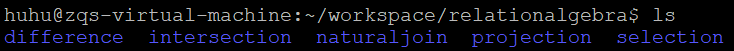

* ### selection

* ##### Input

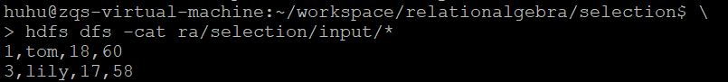

* ##### Run the application
> ./run.sh < col > < value >
> 
> ./run.sh 1 lily

* ##### Output

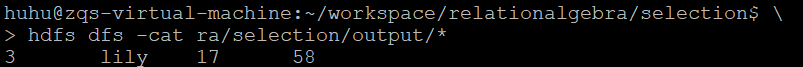

* ##### run.sh
```bash
set -e -x

HADOOP="/opt/hadoop-2.7.4/"
HADOOP_BIN=${HADOOP}"bin/"
STREAM_JAR_PATH=${HADOOP}"share/hadoop/tools/lib/hadoop-streaming-2.7.4.jar"

JOB_PATH="/user/huhu/ra/selection/"
INPUT_PATH=${JOB_PATH}"input"
OUTPUT_PATH=${JOB_PATH}"output"

${HADOOP_BIN}"hdfs" dfs -rm -r -f  -skipTrash $OUTPUT_PATH

${HADOOP_BIN}"hadoop" jar $STREAM_JAR_PATH \
    -D mapreduce.job.reduces=0 \
    -input $INPUT_PATH \
    -output $OUTPUT_PATH \
    -mapper "python map_selection.py "$1" "$2 \
    -file ./map_selection.py
```

* ##### map_selection.py
```python3
#!/usr/bin/python3
import sys
for line in sys.stdin:
    col = int(sys.argv[1])
    val = sys.argv[2]
    item = line.strip().split(',')
    if item[col] == val:
        print( "\t".join( item ) )
```


* ### projection

* ##### Input

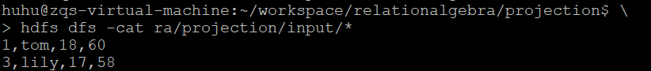

* ##### Run the application
> ./run.sh < col >
> 
> ./run.sh 1

* ##### Output

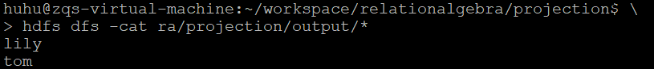

* ##### run.sh
```bash
set -e -x

HADOOP="/opt/hadoop-2.7.4/"
HADOOP_BIN=${HADOOP}"bin/"
STREAM_JAR_PATH=${HADOOP}"share/hadoop/tools/lib/hadoop-streaming-2.7.4.jar"

JOB_PATH="/user/huhu/ra/projection/"
INPUT_PATH=${JOB_PATH}"input"
OUTPUT_PATH=${JOB_PATH}"output"

${HADOOP_BIN}"hdfs" dfs -rm -r -f  -skipTrash $OUTPUT_PATH

${HADOOP_BIN}"hadoop" jar $STREAM_JAR_PATH \
    -D mapreduce.job.reduces=0 \
    -input $INPUT_PATH \
    -output $OUTPUT_PATH \
    -mapper "python map_projection.py "$1 \
    -file ./map_projection.py
```

* ##### map_projection.py
```python3
#!/usr/bin/python
import sys
for line in sys.stdin:
    col = int(sys.argv[1])
    item = line.strip().split(',')
    print( item[col] )
```

* ### intersection

* ##### Input

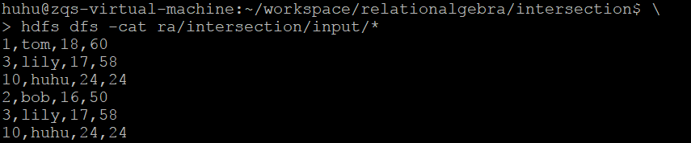

* ##### Run the application
> ./run.sh

* ##### Output

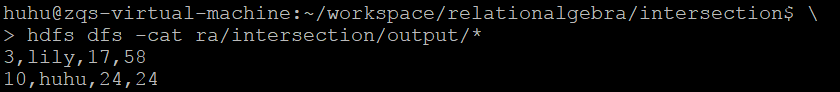

* ##### run.sh
```bash
set -e -x

HADOOP="/opt/hadoop-2.7.4/"
HADOOP_BIN=${HADOOP}"bin/"
STREAM_JAR_PATH=${HADOOP}"share/hadoop/tools/lib/hadoop-streaming-2.7.4.jar"

JOB_PATH="/user/huhu/ra/intersection/"
INPUT_PATH=${JOB_PATH}"input"
OUTPUT_PATH=${JOB_PATH}"output"

${HADOOP_BIN}"hdfs" dfs -rm -r -f  -skipTrash $OUTPUT_PATH

${HADOOP_BIN}"hadoop" jar $STREAM_JAR_PATH \
    -D mapreduce.job.output.key.comparator.class=org.apache.hadoop.mapreduce.lib.partition.KeyFieldBasedComparator \
    -D stream.map.output.field.seqarator=, \
    -D stream.num.map.output.key.fields=4 \
    -D mapreduce.map.output.key.field.separator=, \
    -D mapreduce.partition.keycomparator.options=-k1,1n \
    -input $INPUT_PATH \
    -output $OUTPUT_PATH \
    -mapper cat \
    -reducer "python red_intersection.py" \
    -file ./red_intersection.py \
```

* ##### red_intersection.py
```python3
#!/usr/bin/python3
import sys
old = None
for line in sys.stdin:
    record = line.strip()
    if old == record:
        print(old)
    else:
        old = record
```

* ### difference

* ##### Input

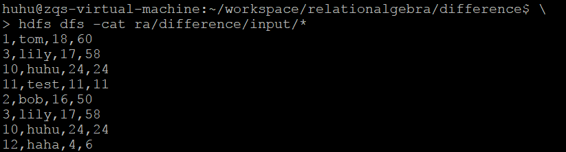

* ##### Run the application
> ./run.sh < relationA/fileA >
> 
> ./run.sh R2.txt

* ##### Output

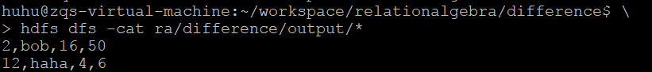

* ##### run.sh
```bash
set -e -x

HADOOP="/opt/hadoop-2.7.4/"
HADOOP_BIN=${HADOOP}"bin/"
STREAM_JAR_PATH=${HADOOP}"share/hadoop/tools/lib/hadoop-streaming-2.7.4.jar"

JOB_PATH="/user/huhu/ra/difference/"
INPUT_PATH=${JOB_PATH}"input"
OUTPUT_PATH=${JOB_PATH}"output"

${HADOOP_BIN}"hdfs" dfs -rm -r -f  -skipTrash $OUTPUT_PATH

${HADOOP_BIN}"hadoop" jar $STREAM_JAR_PATH \
    -D mapreduce.job.output.key.comparator.class=org.apache.hadoop.mapreduce.lib.partition.KeyFieldBasedComparator \
    -D stream.map.output.field.seqarator=, \
    -D stream.num.map.output.key.fields=1 \
    -D mapreduce.map.output.key.field.separator=, \
    -D mapreduce.partition.keycomparator.options=-n \
    -input $INPUT_PATH \
    -output $OUTPUT_PATH \
    -mapper "python3 map_difference.py "$1 \
    -reducer "python3 red_difference.py " \
    -file ./map_difference.py \
    -file ./red_difference.py \
```

* ##### map_difference.py
```python3
import sys
import os

def solve(t):
    for line in sys.stdin:
        line = line.strip() + '.' + t
        print(line)

ra = str(sys.argv[1])
raw_filename = os.getenv('mapreduce_map_input_file')
filename = raw_filename.split('/')[-1]
solve('1' if filename == ra else '2')
```

* ##### red_difference.py
```python3
#!/usr/bin/python3
import sys

old = None
val = 0

for line in sys.stdin:
    record, v = line.strip().split('.')
    v = int(v)
    if old == record:
        val += v
    else:
        if val == 1:
            print(old)
        old = record
        val = v

if val == 1:
    print(old)
```

* ### naturaljoin

* ##### Input

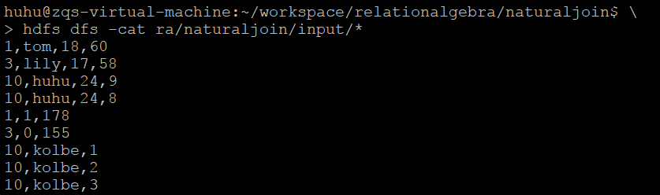

* ##### Run the application
> ./run.sh < col > < relationA/fileA >
> 
> ./run.sh 0 Ra.txt

* ##### Output

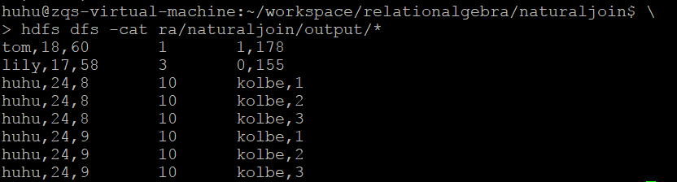

* ##### run.sh
```bash
set -e -x

HADOOP="/opt/hadoop-2.7.4/"
HADOOP_BIN=${HADOOP}"bin/"
STREAM_JAR_PATH=${HADOOP}"share/hadoop/tools/lib/hadoop-streaming-2.7.4.jar"

JOB_PATH="/user/huhu/ra/naturaljoin/"
INPUT_PATH=${JOB_PATH}"input"
OUTPUT_PATH=${JOB_PATH}"output"

${HADOOP_BIN}"hdfs" dfs -rm -r -f  -skipTrash $OUTPUT_PATH

${HADOOP_BIN}"hadoop" jar $STREAM_JAR_PATH \
    -D mapreduce.job.output.key.comparator.class=org.apache.hadoop.mapreduce.lib.partition.KeyFieldBasedComparator \
    -D stream.map.output.field.separator='\t' \
    -D stream.num.map.output.key.fields=1 \
    -D mapreduce.map.output.key.field.separator='\t' \
    -D mapreduce.partition.keycomparator.options=-n \
    -input $INPUT_PATH \
    -output $OUTPUT_PATH \
    -mapper "python3 map_naturaljoin.py "$1" "$2 \
    -reducer "python3 red_naturaljoin.py " \
    -file ./map_naturaljoin.py \
    -file ./red_naturaljoin.py \
```

* ##### map_naturaljoin.py
```python3
#!/usr/bin/python3

import sys
import os

def solve(col, t):
    for line in sys.stdin:
        l = line.strip().split(',')
        key_col = l.pop(col)
        print( key_col, t, ','.join(l), sep='\t')

col = int(sys.argv[1])
ra = sys.argv[2]
raw_filename = os.getenv('mapreduce_map_input_file')
filename = raw_filename.split('/')[-1]
solve(col, '0' if filename == ra else '1')
```

* ##### red_naturaljoin.py
```python3
#!/usr/bin/python3

import sys

old_key = None
work_l = [ [], [] ]

def solve():
    work_l[0].sort()
    work_l[1].sort()
    for i in work_l[0]:
        for j in work_l[1]:
            print( '\t'.join( [i, old_key, j] )   )

for line in sys.stdin:
    key, col, val = line.strip().split()

    if old_key != key:
        solve()
        old_key = key
        work_l = [ [], [] ]
        work_l[int(col)].append(val)
    else:
        work_l[int(col)].append(val)
solve()
```


* ### Java

按照书上提供的算法和代码，用 Intellij IDEA 进行编译打包

目前 selection projection intersection 可以正常运行，但 difference 和 naturaljoin 还有一些bug，问题应该是在重写了读取文件的部分 

