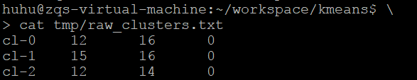
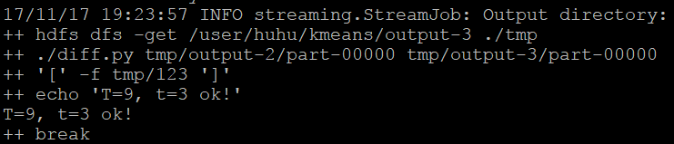
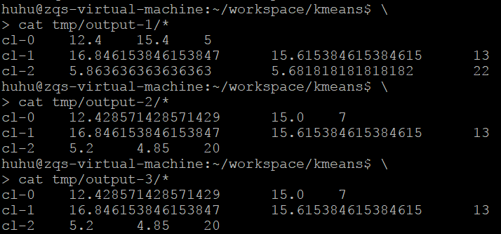
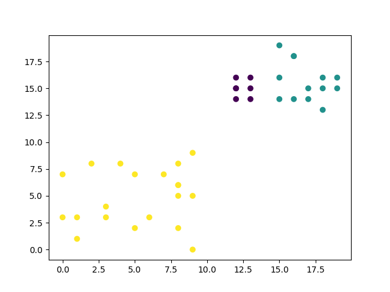
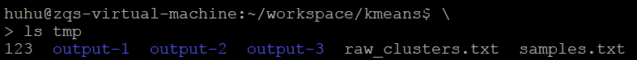

[TOC]

# 作业5

@author: huhu

## 1 设计思路

---
#### 1.1 数据集形式:

    N个D维数据: N rows: each row: <x[1], ..., x[D]>
    x_1_1, ..., x_1_D
      ..., ...,  ...
    x_N_1, ..., x_N_D
    (为了可视化结果，使用二维的测试数据集)

---
#### 1.2 K-Means:

    程序输入是 K个中心 和 T次迭代 (默认 K = 3, T = 9)

    先写一个脚本从N个数据中选择K个初始中心点: (K 动态输入)
        output format: <cli, x1_mean, ..., xD_mean, points_count>

    循环T次: (T 动态输入)
        mapper:
            从外部全局文件读取K个中心 每个中心如下形式：
                <cli, x1_mean, ..., xD_mean, points_count>
            
            给每个数据点分配中心: 和K个中心比较距离 时间开销o(K)
            并记录该中心的统计信息: 
                emit < cli, x[1], ..., x[D] > 
        
        combiner:
            input format: < cli, x[0], ..., x[D] >
            output format: < cli, points_count, sum(x[1]), ..., sum(x[D]) >
            这里记录sum而不是mean，是为了避免舍入误差对算法精度的影响
        
        Key: cli, 
        Value: count & x1_sum & ... & xD_sum
        
        reducer:
            input format: < cli, count, dist_sum >
            for each cli:
                get: total_count & total_x1_sum & ... & total_xD_sum
                calculate: xi_mean <- total_xi_sum / total_count
                emit < cli, x1_mean, ..., xD_mean, points_count >
        
        如果和上一次的结果相同，则终止循环

    (处理文件路径)
    (在T次之前,提前停止循环: 中心位置不变)

---
#### 1.3 分类结果可视化：

    根据 K个中心 -> 每一个数据点 分配 中心
    根据每个点的 坐标(位置) 和 中心(颜色) -> 绘制散点图

---
## 2 文件说明

    run.sh: 该文件实现Kmeans算法
    get_raw_cluster.py: 初始随机选择K个中心
    map.py: mapper
    com.py: combiner
    red.py: reducer
    diff.py: 判断是否和上一次的运行结果相同，若相同则创建一个文件表示相同

    get_graph.py: 根据 数据样本 和 聚类中心 画图

    get_samples.py: 随机生成数据样本
 
## 3 运行和结果展示

运行输入格式: ./run.sh < K > < T >
```bash
# ./run.sh <K> <T>
# default K = 3, T = 9
./run.sh 3 9
```

此时K=3, 随机选择3个初始的中心点:



循环迭代, 按设置T=9, 需要循环执行9次

但是到了第3次发现 -> 已经收敛:即和上一次的结果已经相同 -> 直接终止算法



每次mapreduce的output

可以看出第2次和第3次一样



使用 get_graph.py 可以得到聚类结果的图片



这里使用了一个中间文件夹tmp
    
    其中 123 是 flag ： 用来指示 是否可以停止循环
    output-i 是 第i次的结果 ： 与前一次比较
    raw_clusters.txt 是 初始的中心
    samples.txt 是 测试数据样本


