[TOC]

# HBase

- author huhu

---

## 安装配置

[参考官方文档](https://hbase.apache.org/book.html#quickstart)

- 下载

```bash
wget http://mirror.bit.edu.cn/apache/hbase/stable/hbase-1.2.6-bin.tar.gz
```

- 解压

```bash
tar xzvf hbase-1.2.6-bin.tar.gz
```

- 添加环境变量

```bash
# .bashrc
export HBASE_HOME=/opt/hbase-1.2.6
export PATH=$PATH:$HBASE_HOME/bin
```

- 配置 hbase-env.sh

```bash
# conf/hbase-env.sh
export JAVA_HOME=${your_java_home}
```

---

### 单机

- 配置 hbase-site.xml

    在 hbase-site.xml 文件中添加以下配置

```xml
<!-- conf/hbase-site.xml -->
<configuration>
  <property>
    <name>hbase.rootdir</name>
    <value>file:///home/huhu/hbase</value>
  </property>
  <property>
    <name>hbase.zookeeper.property.dataDir</name>
    <value>/home/huhu/zookeeper</value>
  </property>
</configuration>
```

- 运行

    运行之后使用 jps 查看，出现红框中的 HMaster 进程，就说明单机的 hbase 运行成功了。

    > In standalone mode HBase runs all daemons within this single JVM, i.e. the HMaster, a single HRegionServer, and the ZooKeeper daemon. Go to http://localhost:16010 to view the HBase Web UI.

```bash
./bin/start-hbase.sh
jps
```

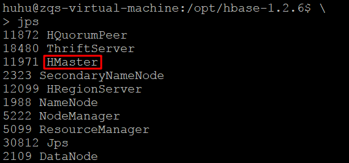

---

### 伪分布式

- 配置 hbase-site.xml

    在 hbase-site.xml 文件中

    - 添加 hbase.cluster.distributed , 设置为 true.
    - 修改 hbase.rootdir , 设置为 hdfs 上的目录


```xml
<!-- conf/hbase-site.xml -->
<configuration>
  <property>
    <name>hbase.rootdir</name>
    <value>hdfs://localhost:9000/hbase</value>
  </property>
  <property>
    <name>hbase.cluster.distributed</name>
    <value>true</value>
  </property>
  <property>
    <name>hbase.zookeeper.property.dataDir</name>
    <value>/home/huhu/zookeeper</value>
  </property>
</configuration>
```

- 运行

    运行之后使用 jps 查看，出现红框中的 ** HMaster HQuorumPeer HRegionServer ** 进程，就说明伪分布式的 hbase 运行成功了。

```bash
./bin/start-hbase.sh
jps
```

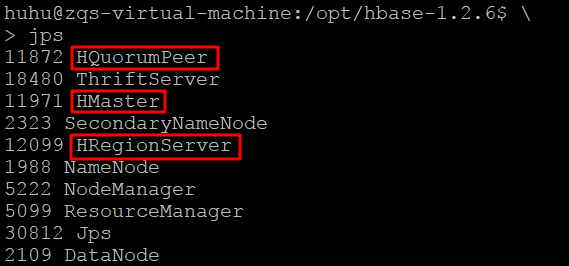

查看 hdfs 

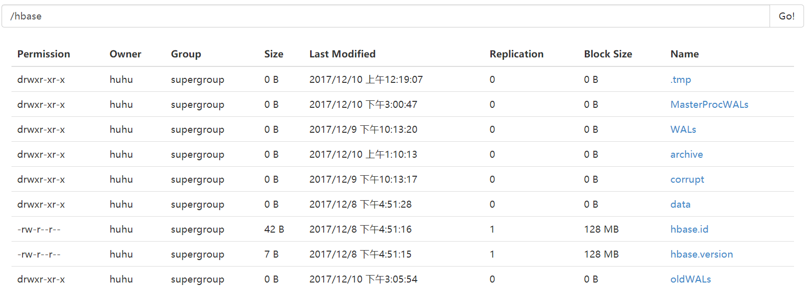

---

## HBase Shell

---

### 运行

- 起服务

```bash
./bin/start-hbase.sh
```

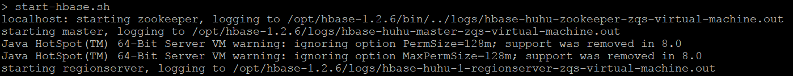

- 使用 hbase shell

```bash
hbase shell
```

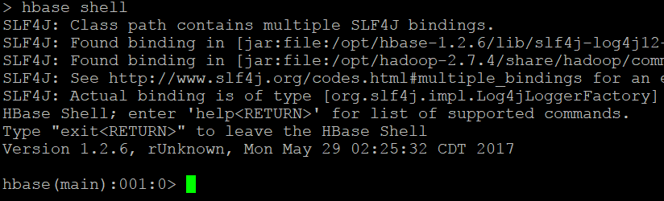

---

### 操作

- 创建数据表

    - create 命令

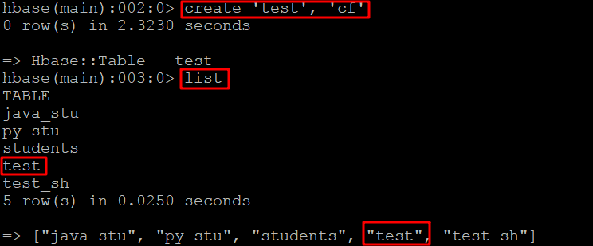

- 添加数据

    - put 命令

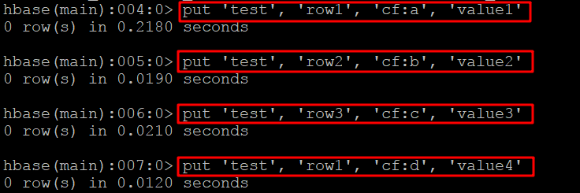

- 查看数据

    - scan 命令

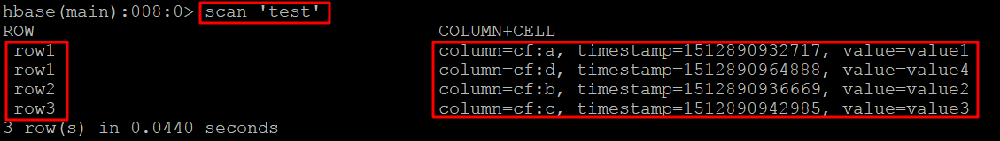

- 获取一行

    - get 命令

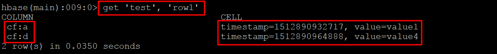

- 删除数据表

    - 先 disable 
    - 才能 drop

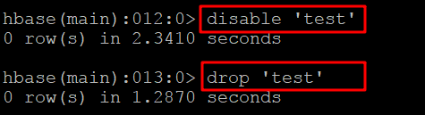


---

## 创建 Students 表

- 表名 列族 列名

```txt
java_stu
Description:Name,Height
Courses:Chinese,Math,Physics
Home:Province
```

- 实际数据

```txt
001 Name:Li Lei,Height:176,Chinese:80,Math:90,Physics:95,Province:Zhejiang
002 Name:Han Meimei,Height:183,Chinese:88,Math:77,Physics:66,Province:Beijing
003 Name:Xiao Ming,Height:162,Chinese:90,Math:90,Physics:90,Province:Shanghai
```

---

### Java

Java 编程创建 Studens 表

- 配置并建立连接

```java
        Configuration cfg = HBaseConfiguration.create();
        cfg.set("hbase.zookeeper.quorum", "localhost");
        Connection conn = ConnectionFactory.createConnection(cfg);
```

- 读取数据
    - 获取 table name
    - 获取 column family
    - 获取 family 和 qualifier 的对应关系

```java
        String filename = "/home/huhu/pyenv/java_stu.table";
        File file = new File(filename);
        BufferedReader reader = null;
        try {
            reader = new BufferedReader(new FileReader(file));
            String tmp;
            tableName = reader.readLine();
            while ( (tmp = reader.readLine()) != null ) {
                String[] t1 = tmp.split(":", 2);
                cfs.add(t1[0]);
                for (String val: t1[1].split(",")
                     ) {
                    q_cf.put(val, t1[0]);
                }
            }
        } catch (IOException e) {
            e.printStackTrace();
        } finally {
            try {
                reader.close();
            } catch (IOException e1) {
            }
        }
```

- 创建table
    + 用 conn 获取 admin
    + 用 HTableDescriptor 封装 表名 和 列族
    + 若已经存在 则先删除 再重新创建

```java
        Admin admin = conn.getAdmin();
        HTableDescriptor t = new HTableDescriptor(TableName.valueOf(tableName));
        for (String cf: cfs
             ) {
            t.addFamily(new HColumnDescriptor(cf));
        }
        if (admin.tableExists(TableName.valueOf(tableName))) {
            System.out.println("exists!\n");
            admin.disableTable(TableName.valueOf(tableName));
            admin.deleteTable(TableName.valueOf(tableName));
        }
        admin.createTable(t);
```

- 添加数据
    + 读取数据
    + put: row family qualifier value
    + List < Put > 批量插入

```java
        String fileData = "/home/huhu/pyenv/students.data";
        file = new File(fileData);
        System.out.println("read data: \n");
        reader = new BufferedReader(new FileReader(file));
        String line = null;
        while( (line = reader.readLine()) != null ) {
            String[] t1 = line.split(" ", 2);
            Put put = new Put(Bytes.toBytes(t1[0]));
            for (String q_val: t1[1].split(",")
                 ) {
                String q = q_val.split(":")[0];
                String val = q_val.split(":")[1];
                String f = q_cf.get(q);
                put.addColumn(Bytes.toBytes(f), Bytes.toBytes(q), Bytes.toBytes(val));
                puts.add(put);
            }
        }
        table.put(puts);
```

- 查看数据表

```java
        System.out.println("scan table: " + tableName + "\n");
        ResultScanner ss = table.getScanner(new Scan());
        for (Result r: ss
                ) {
            for (Cell cell : r.listCells()
                 ) {
                String row = new String(CellUtil.cloneRow(cell));
                String family = new String(CellUtil.cloneFamily(cell));
                String column = new String(CellUtil.cloneQualifier(cell));
                String value = new String(CellUtil.cloneValue(cell));
                long timestamp = cell.getTimestamp();
                System.out.printf("%-20s column=%s:%s, timestamp=%s, value=%s\n",
                        row, family, column, timestamp, value);
            }
        }
```

- 查看创建结果

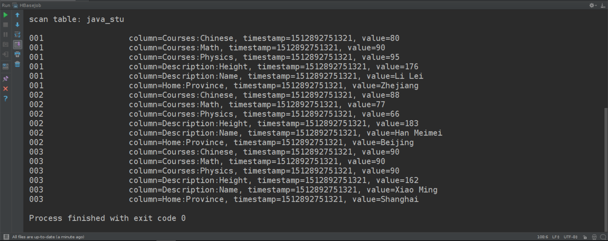

---

### Python

Python 编程创建 Studens 表

- hbase 开启 thrift 服务

```bash
./bin/hbase-daemon.sh start thrift
```

```bash
jps
```

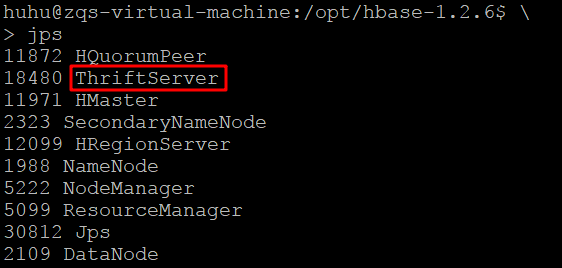

- 使用 happybase

```python
import happybase
```

- 建立连接

```python
conn = happybase.Connection(host=host)
```

- 创建table

```python
table_name = bytes(table_name, encoding='utf8')
if name in conn.tables():
    conn.delete_table(table_name, disable=True)
conn.create_table(table_name, column_family)
```

- 添加数据

```python
table = conn.table(table_name)
with open(path_data, 'r') as f:
    for line in f:
        line = line.strip().split(' ', 1)
        row = line[0]
        data = dict()
        for item in line[1].split(','):
            col, val = item.split(':')
            data[c_index[col] + ':' +  col] = val
        table.put(row, data)
```

- 查看数据

```python
print('scan table...')
print('ROW\t\tCOLUMN+CELL')
for k, vals in table.scan():
    for val in vals:
        s = k.decode('utf8') + '\t\t'
        s += 'column=' + val.decode('utf8')
        s += ', value=' + vals[val].decode('utf8')
        print(s)
```

- 查看创建结果

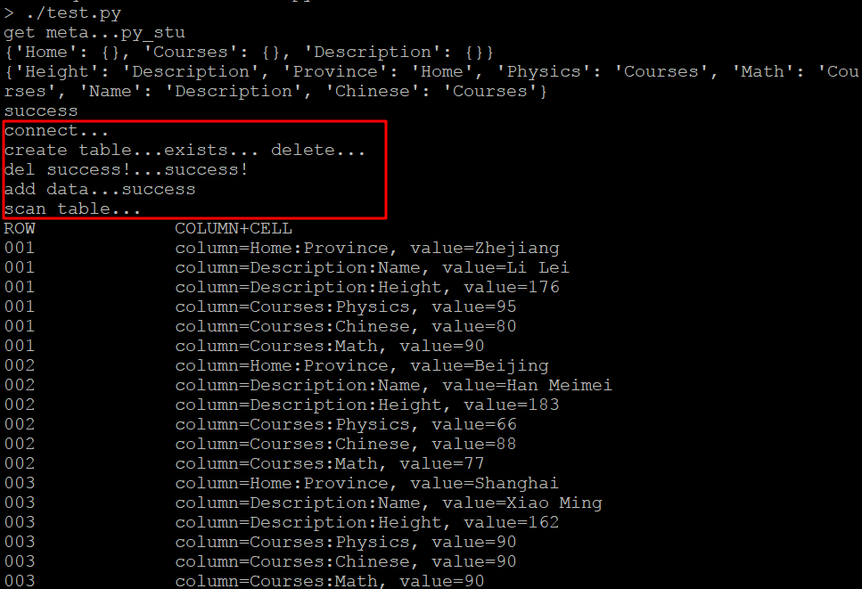

---

