[TOC]

# Hive

##### author huhu

---

## 安装配置

[参考官方文档](https://cwiki.apache.org/confluence/display/Hive/GettingStarted)

##### 下载

```bash
wget http://mirrors.hust.edu.cn/apache/hive/hive-bin.tar.gz
```

##### 解压

```bash
tar -xzvf hive-x.y.z.tar.gz
```

##### 添加环境变量

```bash
# .bashrc
export HIVE_HOME=/opt/hive
export PATH=$PATH:$HIVE_HOME/bin
```

##### 创建 Hive 数据文件目录

```bash
hdfs dfs -mkdir /tmp
hdfs dfs -mkdir /user/hive/warehouse
hdfs dfs -chmod 777 /tmp
hdfs dfs -chmod 777 /user/hive/warehouse
```

---

## Hive CLI

---

### 运行

进入 Hive CLI

```bash
$HIVE_HOME/bin/hive
```

---

### 操作 

---

#### 1 从 HDFS 装载数据

##### 1.1 运行 project1 wordcount 程序 得到 统计结果

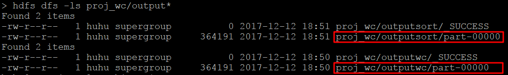

##### 1.2 创建内部数据表

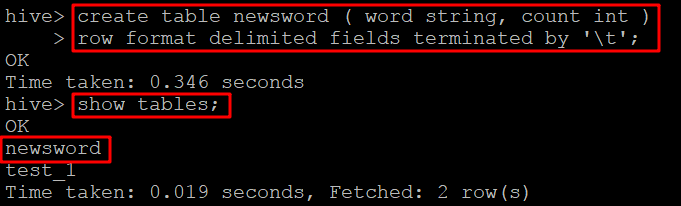

##### 1.3 从 HFDS 装载数据

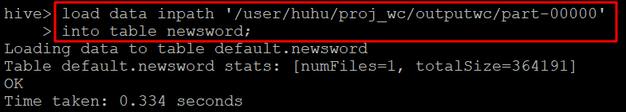

##### 1.4 查询

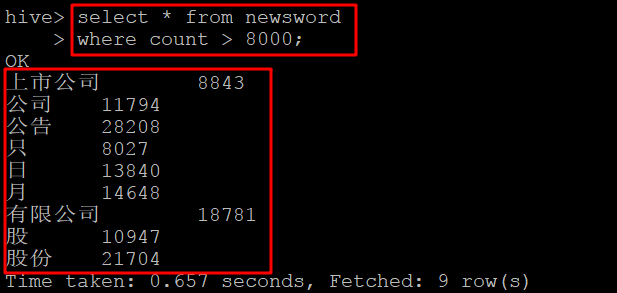

##### 1.5 存在问题

内部表从 HDFS 上装载数据时， ** 数据发生移动 ** 

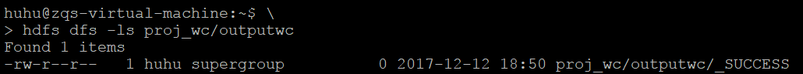

当删除数据表后，实际数据将丢失

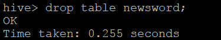

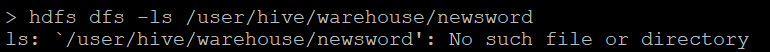

---

#### 2 从 本地 装载数据

##### 2.1 从 HDFS 获取输出 到 本地

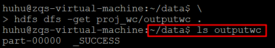

##### 2.2 创建内部数据表 

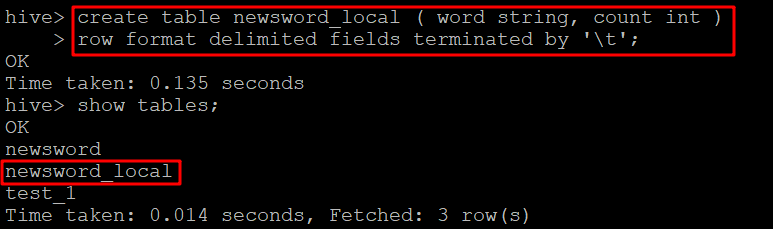

##### 2.3 从本地装载数据 

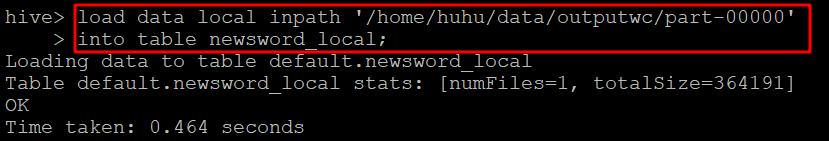

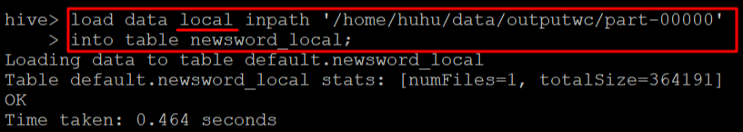

##### 2.4 查询

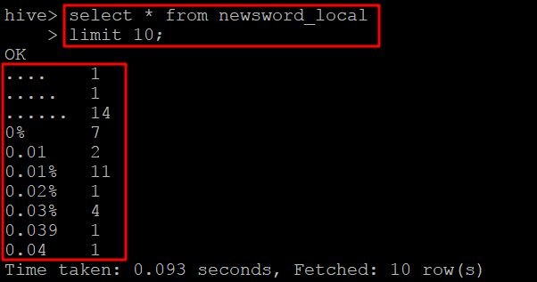

##### 2.5 存在问题

虽然从本地数据创建内部表时，删除数据表后， HDFS 上的数据被删除，本地的数据保留。

但是  **实际应用场景中，文件一般比较大**，会存放在 HDFS 上而不是本地

----

#### 3 创建外部表

( 使用 proj1 **排序后** 的输出 )

##### 3.1 创建外部表 

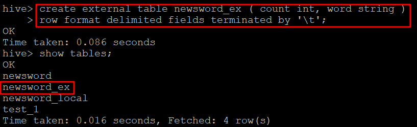

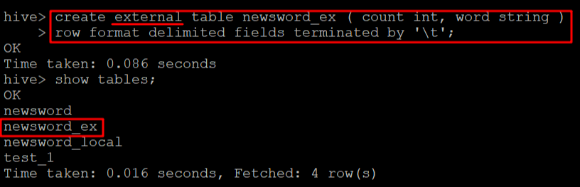

##### 3.2 装载 ( HFDS ) 

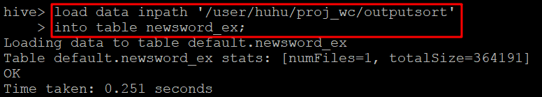

##### 3.3 查询

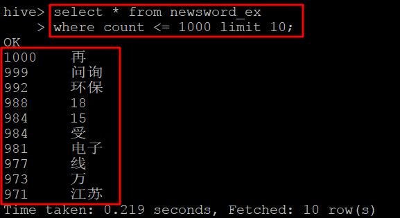

##### 3.4 删除外部表 ( 实际数据不删除 )

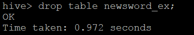

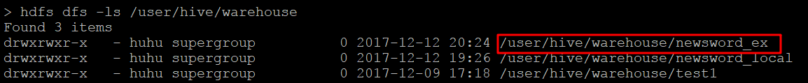


---

#### 4 排序

如果使用 newsword (未排序) 数据表, 查询加排序

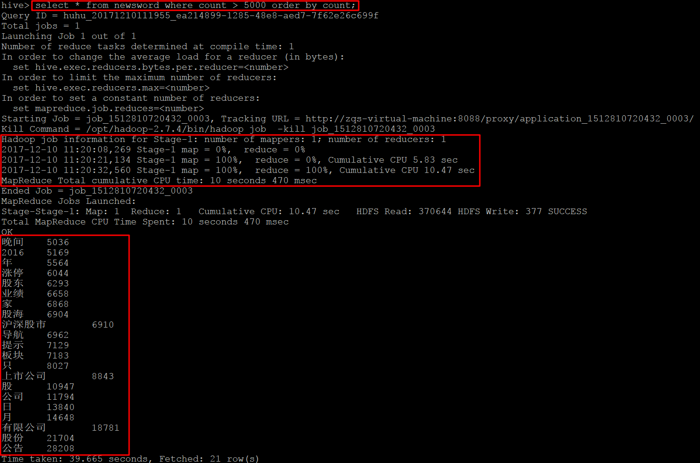

会看到起了一个 mapreduce 任务来完成排序，也印证了 Hive 基于 mapreduce 执行一些操作

不过速度很慢，时效性差

改进：可以使用已经排好序的数据，不需要每次开启一个新的 mapreduce 任务来完成排序，效率更高

---

