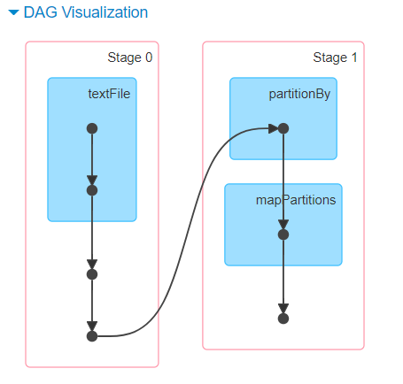
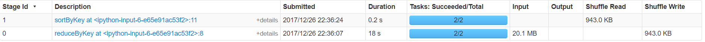
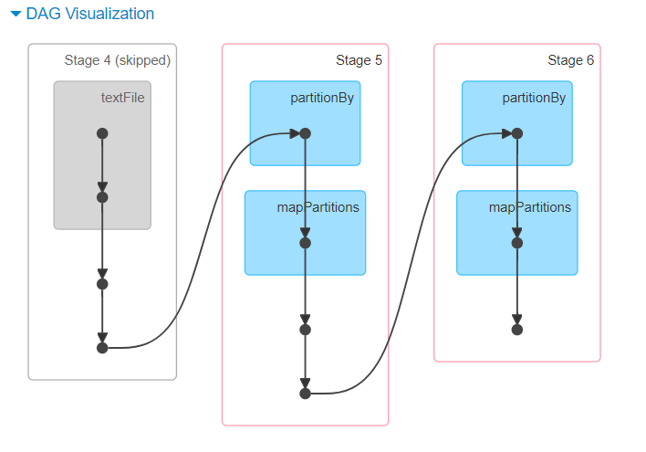
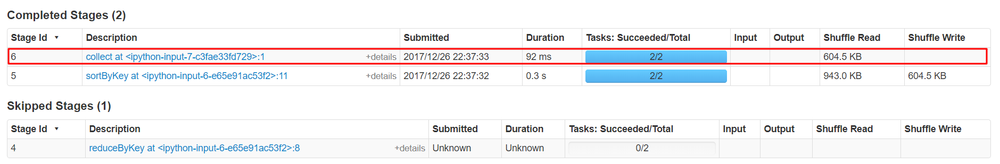
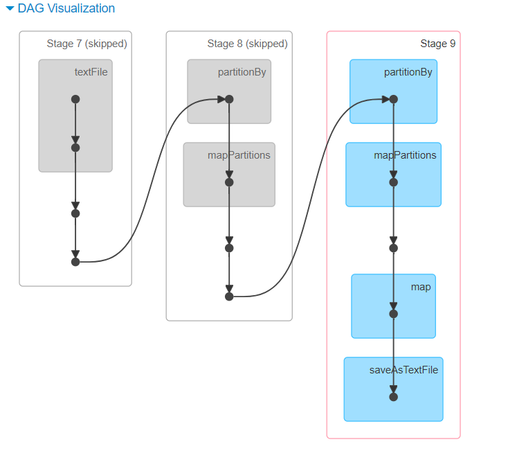
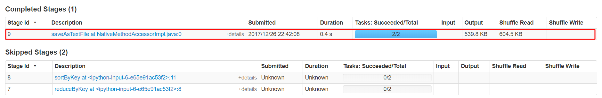
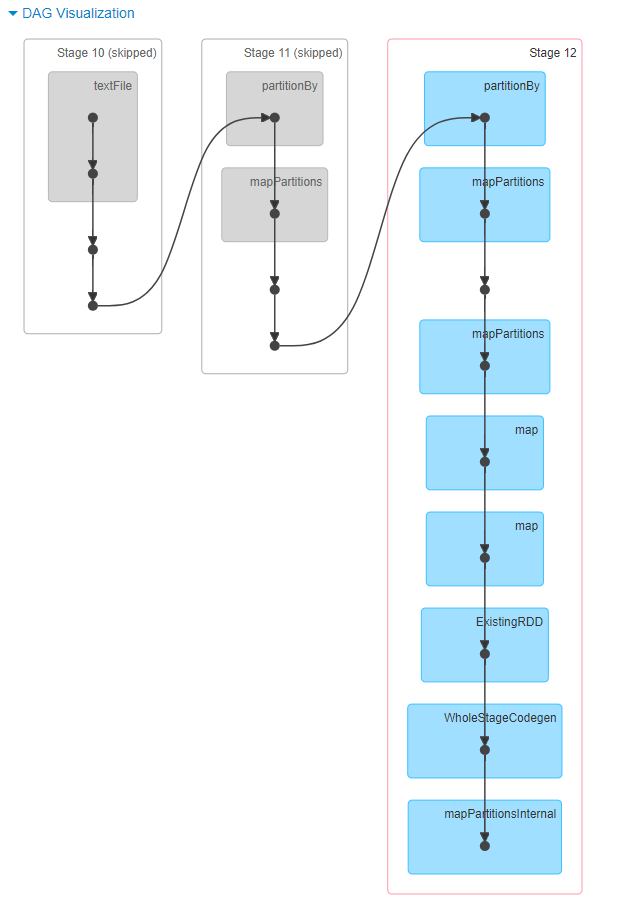
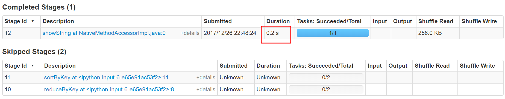

[TOC]

# WordCount - Spark

## author:  huhu

## 1. Spark

- 下载

```bash
wget http://mirrors.shuosc.org/apache/spark/spark-2.2.1/spark-2.2.1-bin-hadoop2.7.tgz
tar xzvf spark-2.2.1-bin-hadoop2.7.tgz -C /opt
```

- 配置环境变量

```bash
export SPARK_HOME=/opt/spark-2.2.1-bin-hadoop2.7
export PATH=$PATH:$SPARK_HOME/bin
```

## 2. 词频统计

### Python

- 2.1 初始化 spark 上下文

```python
import pyspark
sc = pyspark.SparkContext(appName='wordcount')
```

- 2.2 导入数据

```python
full_data = sc.textFile('file:///home/huhu/data/FBDP/proj1/fulldata.txt')
```

- 2.3 数据处理

```python
ans = full_data.flatMap( 
        lambda x: jieba.cut(' '.join(x.split()[4:-1]))
    ).filter(
        lambda x: x not in stop_words 
    ).map( 
        lambda x: (x, 1)
    ).reduceByKey( 
        lambda x, y: x + y
    ).map( 
        lambda x: (x[1], x[0])
    ).sortByKey(False)
```

1. 从每一行获取 新闻文本
2. 中文分词
3. filter 过滤停词
4. map 输出 ( word, 1 )
5. reduce 求和
6. ( word, count ) -> ( count, word)
7. 按词频降序排序

**执行效率**






- 2.4 处理结果

```python
data = ans.collect()
```

**执行效率**





前十个结果

```python
In: data[:10]
Out:    
    [(28208, '公告'),
     (21704, '股份'),
     (18781, '有限公司'),
     (11794, '公司'),
     (10947, '股'),
     (8843, '上市公司'),
     (7183, '板块'),
     (7129, '提示'),
     (6962, '导航'),
     (6910, '沪深股市')]
```

最后十个结果

```python
In: data[:10]
Out:    
    [(1, '带笑'),
     (1, '夜行'),
     (1, '荷叶'),
     (1, '董之争'),
     (1, '韩刚'),
     (1, '002394'),
     (1, '真不贵'),
     (1, '网生'),
     (1, '6278'),
     (1, '齐升')]
```

- 2.5 导出保存数据

```python
ans.saveAsTextFile('file:///home/huhu/output')
```





## 3. Spark SQL

使用Spark SQL查询统计结果中次数超过k次的词语。（可选）

[参考官方文档](https://spark.apache.org/docs/latest/sql-programming-guide.html#sql)

- 3.1 开启 SparkSession

> The entry point into all functionality in Spark is the SparkSession class. To create a basic SparkSession, just use SparkSession.builder:

```python
from pyspark.sql.types import StructField, StructType, StringType, IntegerType
```

- 3.2 从 RDD 创建 DataFrame

> Step 1. Create an RDD of tuples or lists from the original RDD;

这里的 ans 已经是 tuple 形式了

> Step 2. Create the schema represented by a StructType matching the structure of tuples or lists in the RDD created in the step 1.

```python
fields = [StructField('count', IntegerType(), True), StructField('word', StringType(), True)]
schema = StructType(fields)
```

> Step 3. Apply the schema to the RDD via createDataFrame method provided by SparkSession.

```python
schemaWord = spark.createDataFrame(ans, schema)
```

- 3.3 Register the DataFrame as a SQL temporary view

```python
schemaWord.createOrReplaceTempView("news")
```

- 3.4 SQL Queries

```python
results = spark.sql("SELECT * FROM news where count >= 900 and count < 1010")
results.show()
```

    +-----+----+
    |count|word|
    +-----+----+
    | 1006|  发行|
    |  999|  问询|
    |  992|  环保|
    |  988|  18|
    |  984|   受|
    |  984|  15|
    |  981|  电子|
    |  977|   线|
    |  973|   万|
    |  971|  江苏|
    |  961|  24|
    |  945|  风险|
    |  944|  员工|
    |  937|  临时|
    |  932|  医药|
    |  924|  购买|
    |  923|   最|
    |  922|  生物|
    |  920|  募集|
    |  919|  26|
    +-----+----+
    only showing top 20 rows

- DAG 和 运行时间





--- 
