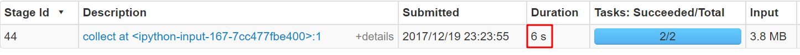
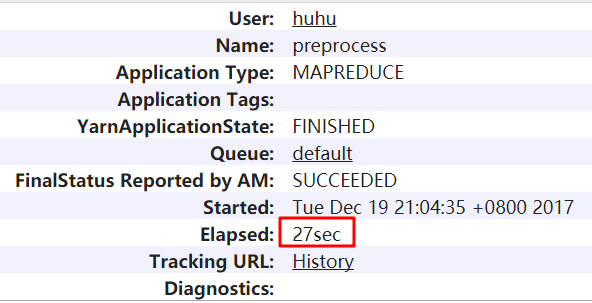
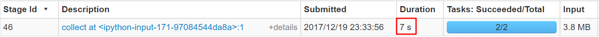
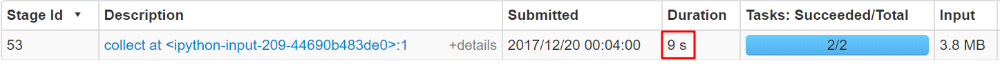
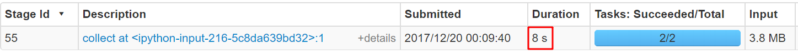
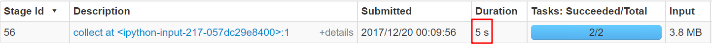
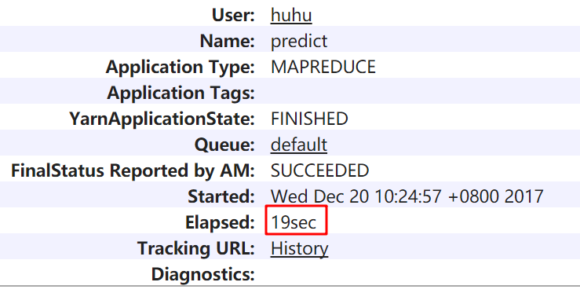

[TOC]

# project2

## author:  huhu

## 数据预处理

### 聚合数据

```bash
cat positive/* > positive.txt
cat neutral/* > neutral.txt
cat negative/* > negative.txt
```

### 打类别标签

```bash
C1='./positive.txt'
C2='./neutral.txt'
C3='./negative.txt'
target='./raw.txt'
awk '{print "1", $0}' ${C1} >  ${target}
awk '{print "2", $0}' ${C2} >> ${target}
awk '{print "3", $0}' ${C3} >> ${target}
```

### 数据清洗

#### 数据样例

- 原始数据

> 1 423. 华股财经 -  (民航局与空军合用机场试点 航空股黄金时代开启) 2015-07-30 (09:02) 机构晨会    据<<<川大智胜>>>2015年一季报，营收增长较快，业绩基本符合预期。公司实现营业收入约4315万元，同比增38.5%;营业利润422万元，同比减22%;归属于上市公司股东的净利润为425万元，同比增5.1%，每股收益为0.03元。 值得一提的是，公司迎合军民融合潮流，锐意革新技术。在2015英特尔信息技术峰会上更是首度推出了首款三维人脸识别产品，该产品将公司自主研发的高精度三维人脸相机建模与识别和英特尔新推出的Realsense摄像头三维人脸数据采集相结合。目前公司正加大对三维人脸识别的产业化和市场拓展，业内预计将成为公司2015年新的利润增长点。

- 转换代码
    + 过滤非中文字符
    + 中文分词
    + 过滤空白字符和停词

```python
def get_text(text):
    text = re.sub("[^\u4e00-\u9fa5]+", " ", text)
    text = ' '.join([ i for i in jieba.cut(text) if not i.isspace() and i not in stop_words])
    return text
```

- 转换结果

> 1  华股 财经 民航局 空军 合用 机场 试点 航空 股 黄金时代 开启 机构 晨会 川大 智胜 季报 营收 增长 业绩 符合 预期 公司 实现 营业 收入 约 万元 同比 增 营业 利润 万元 同比 减 归属于 上市公司 股东 净利润 万元 同比 增 每股 收益 元 值得一提的是 公司 迎合 军民 融合 潮流 锐意 革新 技术 英特尔 信息技术 峰会 更是 首度 推出 首款 三维 人脸识别 产品 产品 公司 自主 研发 高精度 三维 人脸 相机 建模 识别 英特尔 新 推出 摄像头 三维 人脸 数据 采集 相结合 目前 公司 正 加大 三维 人脸识别 产业化 市场 拓展 业内 预计 成为 公司 新 利润 增长点'

#### pyspark

```python
sc = pyspark.SparkContext(appName='preprocess')
text = sc.textFile('file:///home/huhu/workspace/test/raw.txt')
data = text.map( lambda _: ( _[:2], get_text(_[2:] ) ) ).collect()
```

- 执行结果和效率



**其实这里没必要进行 action 操作（因为 transform 过程还没有全部完成），只是为了对比一下效率**

#### Hadoop

```bash
${HADOOP_BIN}"hadoop" jar $STREAM_JAR_PATH \
    -files './map.py' \
    -D mapreduce.job.name="preprocess" \
    -D mapreduce.job.reduces=0 \
    -input $INPUT_PATH \
    -output $OUTPUT_PATH \
    -mapper 'python3 map.py'
```

```python
for line in sys.stdin:
    line = line.strip().split(' ', 1)
    print(line[0], get_text(line[1]))
```

- 执行结果和效率



Spark 效率 优于 Hadoop

---

### 划分数据集

```python
data = text.map(lambda _: (_[:2], get_text(_[2:])) ).randomSplit((0.7, 0.3))
train, test = data
x_train = train.map(lambda x: x[1]).collect()
y_train = train.map(lambda x: x[0]).collect()
```




## 特征提取

- TF-IDF

  将文本转换为 TF-IDF **特征向量**

  应用于 **SVM** 等模型

```python
count_vec = TfidfVectorizer(binary = False)
x_train = count_vec.fit_transform(x_train)
```

- 词频

  将文本转换为 词频 **特征向量**

  应用于 **朴素贝叶斯** 等模型

```python
tmp = CountVectorizer(min_df=1)
tr1_x = tmp.fit_transform(tr1.map(lambda x: x[1]).collect())
ts1_x = tmp.transform(ts1.map(lambda x: x[1]).collect())
```

## 模型训练

### SVM

- 训练

```python
def SvmClass(x_train, y_train, kernel = 'linear'):  
    clf = SVC(kernel = kernel,probability=True)
    clf.fit(x_train, y_train) 
    return clf
clf = SvmClass(x_train, y_train)
```

- 预测

```python
ans = np.array(test.map( 
    lambda x: [ x[0], int(clf.predict(count_vec.transform( [ x[1] ] ))[0] ) ]
).collect() )
np.mean(ans[:, 0].astype(np.int) == ans[:, 1].astype(np.int))
# 0.92935982339955847
```


SVM 性能最好

---

### KNN

- 训练

```python
def KnnClass(x_train, y_train, k = 5):  
    from sklearn.neighbors import KNeighborsClassifier  
    clf=KNeighborsClassifier(k)  
    clf.fit(x_train,y_train)  
    return clf 
knn_clf = KnnClass(x_train, y_train, 3)
```

- 预测

```python
ans3 = np.array( test.map( 
    lambda x: [ x[0], int( knn_clf.predict(count_vec.transform( [ x[1] ] ))[0] ) ] 
) .collect() )
np.mean(ans3[:, 0].astype(np.int) == ans3[:, 1].astype(np.int))
# 0.78695652173913044
```



- k的选择

```python
# k = 3
y_pred = knn_clf.predict(count_vec.transform(x_test))
np.mean(y_pred == y_test)
# 0.78695652173913044
```

```python
# k = 5
y_pred = knn_clf.predict(count_vec.transform(x_test))
np.mean(y_pred == y_test)
# 0.7847826086956522
```

```python
# k = 7
y_pred = knn_clf.predict(count_vec.transform(x_test))
np.mean(y_pred == y_test)
# 0.76521739130434785
```

比较不同的k，发现k比较小的时候，效果更好

---

### 朴素贝叶斯

- 训练

```python
def NbClass(x_train, y_train):  
    from sklearn.naive_bayes import MultinomialNB  
    clf=MultinomialNB(alpha=0.01).fit(x_train, y_train)   
    return clf  
nb_clf = NbClass(x_train, y_train)
```

- 预测

```python
ans4 = np.array(test.map( 
    lambda x: [ x[0], int( nb_clf.predict(count_vec.transform( [ x[1] ] ))[0] ) ] 
) .collect())
np.mean(ans4[:, 0].astype(np.int) == ans4[:, 1].astype(np.int))
# 0.81739130434782614
```



---

### 决策树

- 训练

```python
#========Decision Tree ========#  
def DccisionClass(x_train,y_train):  
    from sklearn import tree  
    clf=tree.DecisionTreeClassifier()  
    clf.fit(x_train,y_train)  
    return clf  
dc_clf = DccisionClass(x_train, y_train)
```

- 预测

```python
ans5 = np.array(test.map( 
    lambda x: [ x[0], int( dc_clf.predict(count_vec.transform( [ x[1] ] ))[0] ) ] 
) .collect())
np.mean(ans5[:, 0].astype(np.int) == ans5[:, 1].astype(np.int))
# 0.65652173913043477
```



决策树模型预测效率很高

---

### KNN - MapReduce

- 读取模型
    + 先使用 pyspark 训练模型 并序列化到本地磁盘
    + 反序列化从本地磁盘读取模型

```python
def load(filename):
    f = open(filename, 'rb')
    obj = pickle.load(f)
    f.close()
    return obj

count_vec = load('./tfidf.model')
x_train = load('./x_train.model')
y_train = load('./y_train.model')
x_test = load('./x_test.model')
n = x_train.shape[0]
one = sp.sparse.csr_matrix(np.ones(n).reshape((n,1)))
```

- 稀疏矩阵的距离计算

```python
def get_dist(x):
    dists = sp.sparse.linalg.norm((x_train - one * x), axis=1)
    return sorted(zip(dists, y_train))[:k]
```

- K个近邻投票
    + 选择得票最多的
    + 得票相同选择最近的

```python
def get_cl(x):
    aDict = dict()
    cls = get_dist(x)
    for j, i in cls:
        if i not in aDict:
            aDict[i] = 1
        else:
            aDict[i] += 1
    if len(aDict) == 3:
        ret = cls[0][1]
    else:
        for i, j in aDict.items():
            if int(j) > 1:
                ret = i
    return ret
```

#### 效率和准确度



准确率： 0.8065217391304348

mapreduce 效率上**差于** pyspark

这里的准确率**优于**之前直接使用的默认的KNN，表明这种邻居选择策略还不错

---