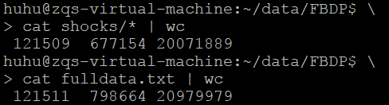
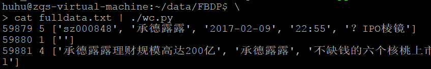
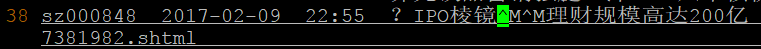
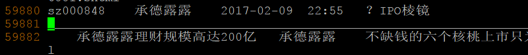
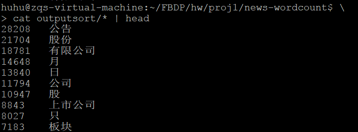
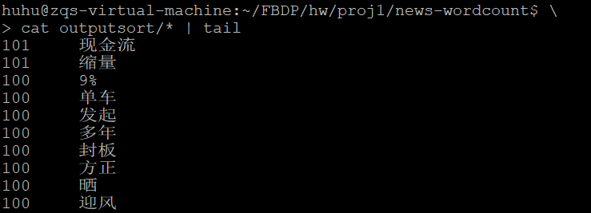
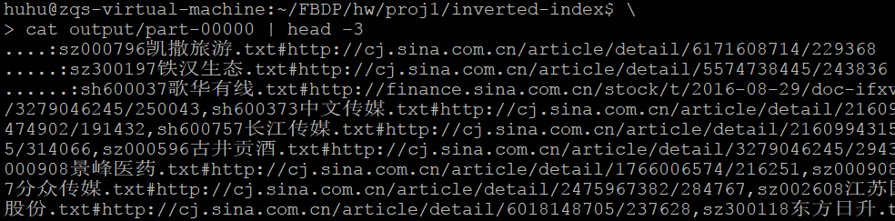
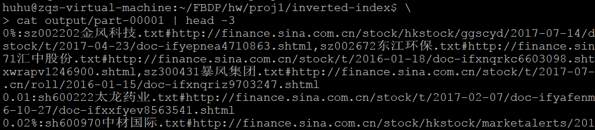

[TOC]

# Project 1

@author huhu

## 需求1

针对股票新闻数据集中的新闻标题，编写WordCount程序，统计所有除Stop-word（如“的”，“得”，“在”等）出现次数k次以上的单词计数，最后的结果按照词频从高到低排序输出。

---
### 1.1 设计思路

##### first mapreduce job: 过滤停词 -> 统计词频 -> 过滤小于k次的单词

    mapper:
        初始化: 获取所有停词(stop-words)
        对每一行处理: 
            获取新闻标题 -> 
            对标题分词 -> 
            对每一个单词:
                如果 单词合法(不是停词、不是空白字符、……) 
                那么 emit <word, 1>
    
    combiner:
        同一个word的次数加在一起 (对同一个Key的Value求和)
        input format:   <word, 1>
        output format:  <word, local-count>

    reducer: (like the combiner)
        同一个word的次数加在一起
        如果 总次数 >= k 则 emit <word, global-count>
        input format:  <word, local-count>
        output format: <word, global-count>

##### second mapreduce job: 全局排序: 按**词频倒序**, 词频相同按**词语字典顺序**

    map:
        input format:  <word, count>
        output format: <func(count), word>

    reducer.num:1    (全排序) (也实现了多reducer的全排序版本)    
    key.filed.num:2  (二级排序)

    reduce:
        input format:  <new_count, word> 
        output format: <func^(-1)(new_count), word>

##### \* func 函数 ！

    默认排序是 先比较 Key的第一个字段 字典序较小的优先
              再比较 Key的第二个字段 字典序较小的优先
    但是词频是数字类型，按字典序排序时会出现问题： 1比2优先   10比2优先
                        我们希望实现： 10比2优先  2比1优先

但是hadoop streaming对comparator的支持不好

很难实现要求Key的一个字段按数字排序 另一个字段按字符串排序

我们希望按字符串排序，并实现 func(10) < func(2) < func(1)

    所以对count进行一个转换
    (1) x加上一个大数 -> 实现数字类型按字典序排序时顺序不变
        f(x) = 10000 + x  
        1 < 2 < 10
        '10001' < '10002' < '10010'
    (2) 一个大数减去x -> 实现数字类型的倒序排列
        g(x) = 10000 - x
        1 < 2 < 10
        9999 > 9998 > 9990
    (3) 把(1)(2)组合
        h(x) = f(g(x)) = 10000 + (10000 - x) = 20000 - x
        1 < 2 < 10
        '19999' > '19998' > '19990'
        此时 10 排在 2 前，2 排在 1 前

    这个大数要大于最大的词频，使用 100000 即可

总结一下： 
先用一个大数减去count，实现数字级别的倒序; 再用一个大数加上它，实现字符串级别的倒序

这种算法的泛化性非常强，可以完美解决这个问题！

---
### 1.2 实现细节

#### 1.2.1 词频统计

##### \* 提取文本: 新闻标题

###### \* (1) 自我校验

分析数据集每行的pattern，使用三种不同的提取新闻标题文本的方法，三种方法**互相检验正确性**

(1)空白字符作为分隔符 + 选择第四个元素到倒数第二个元素的所有部分
```python3
news_title = ' '.join(line.split()[4:-1]).strip()
```

(2)冒号作为分隔符 + 选择第二个元素到倒数第二个元素的所有部分
```python3
news_title = ' '.join(line.split(':')[1:-1])[2:-4].strip()
```

(3)正则表达式匹配: r'\d\d:\d\d(.*?)http://'
```python3
news_title = re.search(patterns, line).group(1).strip()
```

三种不同方式的提取结果，检验提取的新闻标题是否有有错误，是否提取完全

###### \* (2) 数据集问题

同时，发现了 fulldata.txt ** 数据的问题！ **

(1) 一开始我发现数据行数不一样，很奇怪，但是没有深究，也没有办法深究


(2) 运行中出现问题，写了一个脚本(wc.py) 找出 小于6个item 的行
```python3
for row, line in enumerate(sys.stdin):
    if len(line.strip().split('\t')) <= 5:
        print(row, len(line.strip().split('\t')), line.strip().split('\t'))
```



(3) 定位文件

shock/sz000848.txt


fulldata.txt



数据集中有**奇怪的字符^M^M** 在解析的时候变成了两个换行！修改数据即可！

##### 中文分词

    python 结巴中文分词包

```python3
import jieba
text = "some text"
jieba.cut(text)
```

##### 参数-k

    这个实现很简单
    (1)在wordcount的reducer中只输出value大于等于k的<key, value>对 (38 + 30 sec)
    (2)在sort的mapper中只处理value大于等于k的<key, value>对 (39 + 32 sec)
    比较两种计算时间 -k 100 还是相差不大 

但第一种方法网络传输开销小很多! 这里展示第一种实现的代码。

##### mapper

```python3
import sys
import jieba

stop_words = set()

def emit(item):
    print(item + "\t" + "1")

def stop_file(filename):
    global stop_words
    with open(filename, 'r') as f:
        for word in f:
            if word.strip():
                stop_words.add(word.strip())

def solve_stop(word):
    if word not in stop_words and not word.isspace():
        emit(word)

def main(argv):
    for line in sys.stdin:
        words = ' '.join(line.split()[4:-1]).strip()
        for word in jieba.cut(words):
            solve_stop(word)

if __name__ == '__main__':
    if len(sys.argv) > 1:
        stop_file(sys.argv[1])
    main(sys.argv)
```

##### combiner

```python3
import sys

old_key = None
old_values = 0

for line in sys.stdin:
    new_key, _ = line.strip().split()
    if old_key != new_key:
        if old_values: 
            print('\t'.join([old_key, str(old_values)]))
        old_key = new_key
        old_values = 0
    old_values += 1

if old_values: 
    print('\t'.join([old_key, str(old_values)]))
```

##### reducer

```python3
import sys

k = 0
if len(sys.argv) == 3 and sys.argv[1] == '-k':
    k = int(sys.argv[2])

old_key = None
old_values = 0

for line in sys.stdin:
    new_key, new_value = line.strip().split()
    new_value = int(new_value)
    if old_key != new_key:
        if old_values and old_values >= k:
            print('\t'.join([old_key, str(old_values)]))
        old_key = new_key
        old_values = 0
    old_values += new_value

if old_values and old_values > k: 
    print('\t'.join([old_key, str(old_values)]))

```

#### 1.2.2 全局排序

实现了两个版本：单reducer(22sec) 和 多reducers(38sec)

        单reducer: 不需要处理 自动全局排序
        多reducer实现：
            需要手动按大小分桶
            好处是并行处理
但是运行发现**当前数据规模**单reduer运行更快

##### 单reducer + func-Key转换 版本

map.py
```python3
base = 200000
for line in sys.stdin:
    val, k = line.strip().split()
    new_k = base - int(k)
    print('\t'.join([str(new_k), val]))
```

red.py
```python3
base = 200000
for line in sys.stdin:
    k, val = line.strip().split()
    new_k = base - int(k)
    print('\t'.join([ str(new_k), val ]))
```

##### 多reducer + local-sort 版本

map.py
```python3
reducer_num = 4
for line in sys.stdin:
    k, v = line.strip().split()
    p = reducer_num - 1 - int(log(int(v)) / log(10))
    print('\t'.join([str(p), v, k]))
```

red.py
```python3
o = None
ol = list()
for line in sys.stdin:
    p, k, v = line.strip().split()
    if o != k:
        ol.sort()
        for i in ol:
            print('%s\t%s'%(o, i))
        o = k
        del ol
        ol = list()
    ol.append(v)
ol.sort()
for i in ol:
    print('%s\t%s'%(o, i))
```

---
### 1.3 程序运行说明

run.sh
```bash
hadoop jar $STREAM_JAR_PATH \
    -files ${DATA_PATH}"stopwords.txt#STOP","map_word.py","combine_word.py","filter_word.py" \
    -D mapreduce.job.name="wordcount-mysum" \
    -input $INPUT_PATH \
    -output $OUTPUT_PATH_T \
    -mapper "python3 map_word.py STOP" \
    -combiner "python3 combine_word.py " \
    -reducer "python3 filter_word.py ""$*" 

hadoop jar $STREAM_JAR_PATH \
    -files "./smap.py","./sred.py" \
    -D mapreduce.job.name="wordcount-sort-reducer1" \
    -D stream.num.map.output.key.fields=2 \
    -D mapreduce.partition.keycomparator.options=-k1,2 \
    -D mapred.reduce.tasks=1 \
    -D mapreduce.job.output.key.comparator.class=org.apache.hadoop.mapreduce.lib.partition.KeyFieldBasedComparator \
    -input $OUTPUT_PATH_T \
    -output $OUTPUT_PATH \
    -mapper "python3 smap.py" \
    -reducer "python3 sred.py" 
```

运行命令

./run.sh \[ -k \] \[ Integer \]

---
### 1.4 运行结果展示





---
### 1.5 性能扩展性评估

1. 扩展性不足之处
    
    输入文件太多(这里有3000+个文件), input split过多, 需要的mapper就很多, 执行非常慢, 只能提前把数据集先进行合并(小文件合并为大文件), 

2. 扩展性亮点

    func函数对Integer的处理

3. 性能评估

    单reducer和多reducer的性能比较
    通过算法提升性能的空间已经不大了

---
## 需求2

针对股票新闻数据集，以新闻标题中的词组为key，编写带URL属性的文档倒排索引程序，将结果输出到指定文件。

(因为HDFS并不适合存储大量小文件，而且处理效率很低，所以处理合并文件fulldata.txt)

文档名: 股票代码+股票名称.txt

---
### 2.1 设计思路

##### mapper

    每一行，我们可以得到这些信息: code name date time news-title URL

    对新闻标题进行中文分词 并且 对词语去重 -> every term
    股票代码+股票名称+'.txt' -> 文档名 -> docid
    网页链接URL -> payload

    output format: < term, docid, payload >

    set key: < term, docid >  (好处：二级排序 reducer可以直接输出value 空间开销o(1))
    set partitioner: < term > 

##### reducer

    reducer就是输出格式的处理
    output format: (term:docid#payload,docid#payload...)
    所有行按term排序，每一行内按docid排序
    (如果我们需要payload也是排序的, 只要 set key: < term, docid, payload >)

---
### 2.2 实现细节

##### mapper

和上一个任务几乎完全一样

展示部分核心代码 map.py
```python3
for line in sys.stdin:
    total = line.strip().split()
    code, name = total[:2]
    filename = code + name + '.txt'
    title = ' '.join(total[4:-1])
    url = total[-1]
    for word in set(jieba.cut(title)):
        if word_filter(word):
            emit([word, filename, url])
```

##### reducer

读每一行：
    
    如果遇到一个新的单词： 输出'\n'换行(不是第一个单词)，并输出'term:docid#payload'
    否则：输出 ',docid#payload'

展示部分核心代码 red.py
```python3
for line in sys.stdin:
    new_key, value = line.strip().split('\t', 1)
    value = value.replace('\t', '#')
    if old_key != new_key:
        if old_key != None:
            print()
        print(new_key, end = '')
        print(':' + value, end = '')
        old_key = new_key
    else:
        print(',' + value, end = '')
```

##### reducer 数量

在上传到github上时，因为输出文件大于100M，上传被拒绝

设置reducer的数量为两个，成功上传！(虽然警告超过了建议的大小50M)

---
### 2.3 程序运行说明

run.sh: 

```bash
hadoop jar $STREAM_JAR_PATH \
    -files ${DATA_PATH}"stopwords.txt#SKIP","map.py","red.py" \
    -D mapreduce.job.name="inverted-index" \
    -D mapred.reduce.tasks=2 \
    -D stream.num.map.output.key.fields=2 \
    -D num.key.fields.for.partition=1 \
    -D mapreduce.partition.keypartitioner.options=-k1 \
    -partitioner org.apache.hadoop.mapred.lib.KeyFieldBasedPartitioner \
    -input $INPUT_PATH \
    -output $OUTPUT_PATH \
    -mapper "python3 map.py SKIP" \
    -reducer "python3 red.py " 
```

运行命令

./run.sh

---
### 2.4 运行结果展示





---
### 2.5 性能扩展性评估

1. 一个思考

    原始数据大约20M, 生成的倒排索引文件大约103M, 空间大了非常多
    
    原因是: 

        (1) 原来一句话对应一个url, 现在一句话的每一个词语都要对应这个url, 空间开销大了很多; 
        (2) 存放了很多docid, 其实在这个应用中docid没有实际意义, 主要是为了编程练习

    考虑的解决方案

        (1) 增加完善停词表: 目前结果中有很多词语没有意义, 可以过滤
